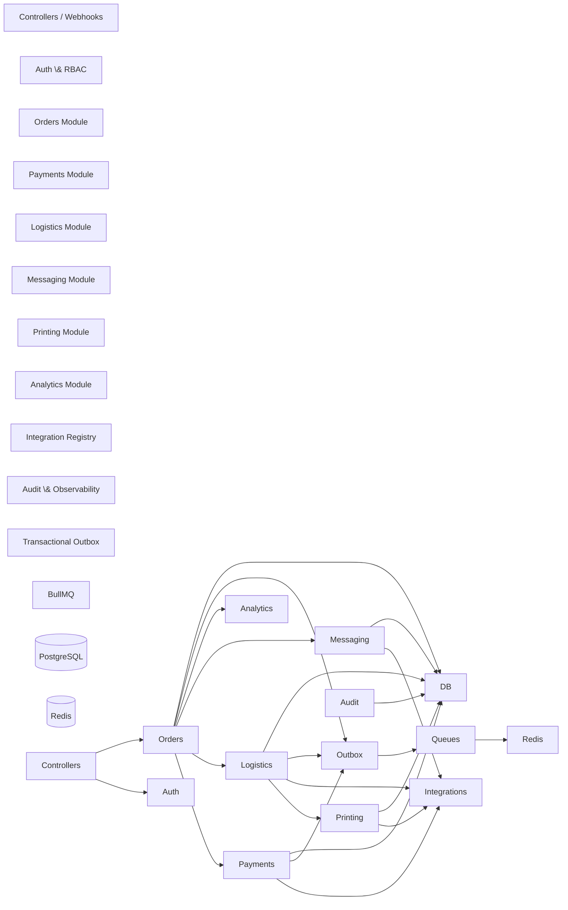
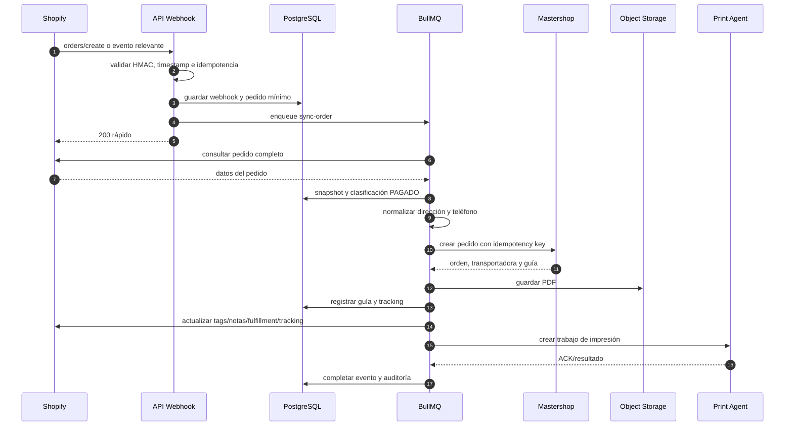
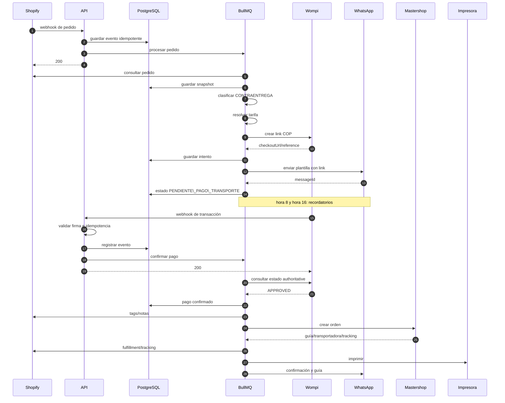
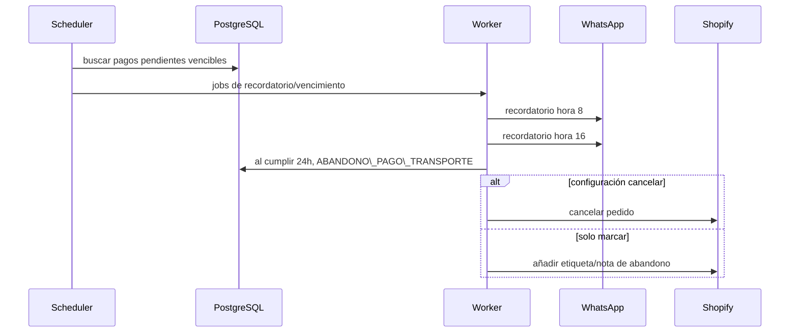
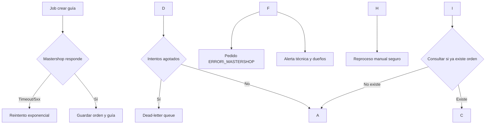
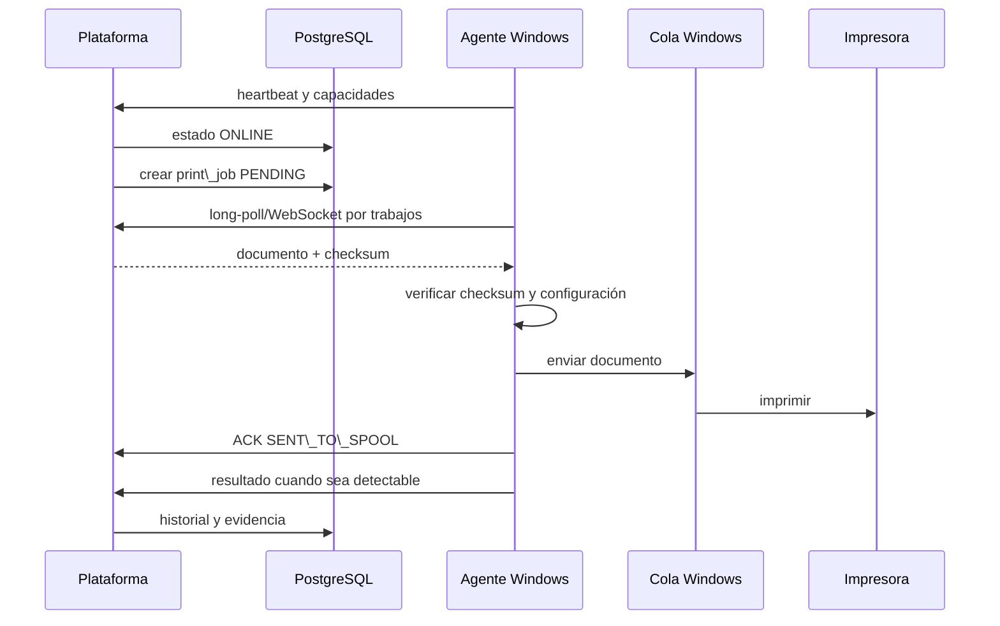
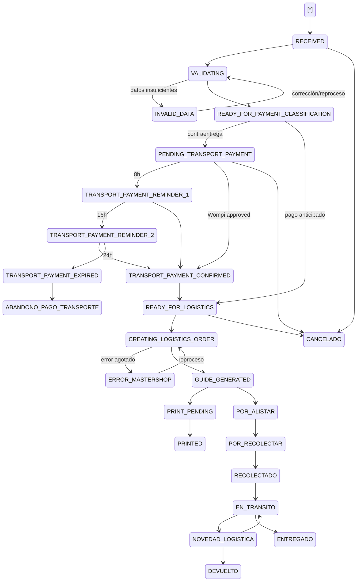
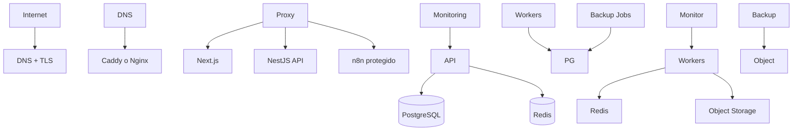

# ESPECIFICACIÓN MAESTRA DE IMPLEMENTACIÓN

## Plataforma Ecommerce Inteligente: Shopify + Wompi + Mastershop + WhatsApp + Impresión + BI

**Versión del documento:** 1.0  
**Estado:** listo para diseño técnico detallado e implementación iterativa  
**Tipo de solución:** plataforma interna para una empresa, preparada para conectar múltiples tiendas Shopify  
**Infraestructura objetivo:** Oracle Cloud Pay As You Go  
**Presupuesto inicial de infraestructura y servicios:** aproximadamente USD 35/mes  
**Volumen objetivo inicial:** mínimo 500 pedidos/día en temporada alta  
**Responsable técnico y de alertas críticas:** Sebastián Montes Giraldo  
**Correo técnico:** `sebastianmontesg@gmail.com`  
**WhatsApp técnico:** `+57 314 609 3899`

\---

# 0\. INSTRUCCIONES IMPERATIVAS PARA LA IA DESARROLLADORA

Este documento es la fuente principal de verdad del proyecto. La IA que diseñe o programe la solución deberá cumplir estas reglas:

1. No inventar endpoints, firmas, payloads, códigos de estado, capacidades, precios ni comportamientos de Shopify, Wompi, Mastershop, Meta, Google Ads, TikTok Ads o cualquier tercero.
2. Cuando una integración no tenga documentación suficiente, crear primero:

   * interfaz de proveedor;
   * adaptador;
   * mock;
   * fixtures;
   * pruebas de contrato;
   * feature flag;
   * modo simulación;
   * kill switch.
3. No comenzar escribiendo toda la plataforma. Trabajar por verticales funcionales pequeñas, demostrables y reversibles.
4. No declarar una tarea como terminada si:

   * no compila;
   * falla lint;
   * falla typecheck;
   * fallan pruebas;
   * no cumple criterios de aceptación;
   * no se revisó idempotencia;
   * no se revisaron errores y observabilidad;
   * no se actualizó documentación.
5. Toda decisión no definida deberá registrarse como:

   * `SUPUESTO`;
   * `DECISIÓN PENDIENTE`;
   * `RIESGO`;
   * `BLOQUEANTE`.
6. Nunca colocar credenciales, tokens, teléfonos, correos operativos o secretos directamente en el código.
7. Toda operación externa debe ser trazable mediante:

   * `correlationId`;
   * `causationId`;
   * `orderId`;
   * `storeId`;
   * `provider`;
   * número de intento;
   * fecha;
   * resultado.
8. Toda operación susceptible de repetición debe ser idempotente.
9. Toda integración debe tolerar:

   * reintentos;
   * webhooks duplicados;
   * webhooks tardíos;
   * eventos fuera de orden;
   * timeout;
   * respuesta perdida;
   * caída temporal del proveedor.
10. Las acciones destructivas o irreversibles requieren autorización humana explícita:

    * migraciones destructivas;
    * eliminación de datos;
    * cancelación masiva;
    * cambios de permisos;
    * despliegue a producción;
    * rotación de secretos;
    * cambios en reglas financieras;
    * activación de automatizaciones reales en Mastershop.
11. La IA debe revisar documentación oficial vigente antes de implementar cada integración.
12. Si la documentación real contradice este archivo, no alterar silenciosamente el alcance: registrar la incompatibilidad y proponer una decisión.
13. Mantener un archivo `PROJECT\_STATUS.md` con:

    * fase actual;
    * tareas completadas;
    * tareas en curso;
    * bloqueos;
    * riesgos;
    * pruebas;
    * deuda técnica;
    * siguiente paso.
14. Mantener ADRs en `docs/adr/`.
15. Mantener contratos de integración versionados en `docs/contracts/`.
16. Mantener diagramas Mermaid actualizados junto con el código.
17. No utilizar n8n como sustituto del dominio transaccional ni de la máquina de estados.

\---

# 1\. VISIÓN DEL PRODUCTO

Construir una plataforma empresarial que centralice y automatice el ciclo operativo de ecommerce:

```text
Shopify
  → recepción del pedido
  → validación y normalización
  → clasificación del método de pago
  → cobro anticipado del transporte cuando sea contraentrega
  → confirmación de Wompi
  → creación del despacho en Mastershop
  → selección de transportadora
  → generación de guía
  → actualización de Shopify
  → impresión automática local
  → seguimiento logístico
  → entrega o devolución
  → métricas, rentabilidad y auditoría
```

La plataforma debe eliminar la validación manual previa a la creación de guías. Los errores no deberán perder pedidos ni requerir búsquedas manuales en múltiples sistemas.

\---

# 2\. OBJETIVOS

## 2.1 Objetivos funcionales

* Recibir pedidos de una o múltiples tiendas Shopify.
* Identificar pago anticipado y pago contraentrega.
* Cobrar anticipadamente el transporte de todos los pedidos contraentrega.
* Enviar automáticamente el enlace mediante Meta WhatsApp Cloud API.
* Procesar la confirmación de Wompi.
* Crear automáticamente el despacho en Mastershop.
* Generar, almacenar y enviar la guía a impresión.
* Actualizar Shopify con etiquetas, notas, fulfillment y tracking.
* Monitorear estados de Mastershop.
* Administrar conversaciones de WhatsApp.
* Ofrecer dashboard operativo, financiero y publicitario.
* Mantener histórico completo.
* Permitir conciliación y reproceso seguro.
* Gestionar integraciones, usuarios, permisos, plantillas, tarifas e impresoras.

## 2.2 Objetivos no funcionales

* Soportar al menos 500 pedidos por día.
* Procesar cada pedido exactamente una vez a nivel de efecto de negocio, aunque la infraestructura use entrega “al menos una vez”.
* Recuperarse de errores temporales.
* Tener tiempo objetivo de recuperación operativa máximo de 35 minutos.
* Mantener backups nocturnos.
* Conservar información histórica y auditoría por hasta 10 años según la política definida.
* Operar inicialmente con presupuesto reducido.
* Ser desplegable mediante Docker Compose.
* Mantener seguridad, auditabilidad, extensibilidad y capacidad de observación.

## 2.3 Fuera del alcance inicial

* SaaS multiempresa.
* Aplicación móvil nativa.
* Kubernetes.
* Microservicios independientes.
* Administración de inventario como fuente de verdad.
* Checkout propio de tarjetas.
* ZPL nativo de Mastershop.
* Automatización de reembolsos.
* IA predictiva en el MVP.
* Staging dedicado, salvo que el presupuesto cambie.
* Correo como canal de pago en la primera versión.

\---

# 3\. PRINCIPIOS ARQUITECTÓNICOS

1. **Monolito modular primero.**
2. **Workers separados por proceso, mismo repositorio.**
3. **Base de datos relacional como fuente transaccional.**
4. **Outbox transaccional para publicación de eventos.**
5. **Colas para efectos externos.**
6. **Idempotencia en cada frontera.**
7. **Adaptadores por proveedor.**
8. **No depender de n8n para consistencia del negocio.**
9. **Datos históricos inmutables donde corresponda.**
10. **Observabilidad desde el primer vertical.**
11. **Automatización con controles de seguridad.**
12. **Costos mínimos, posibilidad de escalar después.**

\---

# 4\. STACK TECNOLÓGICO OBJETIVO

## 4.1 Monorepo

* `pnpm workspaces`
* Turborepo
* TypeScript con modo estricto
* ESLint
* Prettier
* Conventional Commits
* Changesets o versionado equivalente cuando sea necesario

## 4.2 Frontend

* Next.js 15
* React 19
* TypeScript
* Tailwind CSS
* shadcn/ui
* Radix UI
* TanStack Query
* Zustand solo para estado local/global de interfaz que no sea estado de servidor
* Recharts para dashboards
* React Hook Form
* Zod
* Accesibilidad WCAG 2.1 AA como objetivo

## 4.3 Backend

* Node.js en versión LTS compatible, fijada en `.nvmrc` y `package.json`
* NestJS
* REST API
* WebSockets o Server-Sent Events para actualizaciones operativas
* OpenAPI/Swagger
* Prisma ORM
* PostgreSQL
* Redis
* BullMQ
* Zod y/o class-validator en bordes de entrada
* Pino para logs estructurados

## 4.4 Automatización

* n8n self-hosted
* Debe utilizarse para:

  * reportes no críticos;
  * notificaciones administrativas secundarias;
  * sincronizaciones auxiliares;
  * procesos programados no transaccionales;
  * integraciones experimentales.
* No debe utilizarse como dueño de:

  * máquina de estados;
  * confirmación de pagos;
  * creación idempotente de guías;
  * conciliación principal;
  * seguridad;
  * autorización.

## 4.5 Almacenamiento

* PostgreSQL para datos estructurados.
* Redis para cache, locks y BullMQ.
* Oracle Object Storage o almacenamiento S3-compatible para:

  * guías;
  * facturas;
  * picking lists;
  * exports;
  * evidencias.
* En desarrollo local: MinIO.

## 4.6 Pruebas

* Vitest o Jest para pruebas unitarias.
* Supertest para API.
* Testcontainers para PostgreSQL y Redis.
* Playwright para E2E.
* Pact o contratos JSON Schema para integraciones.
* k6 para carga.
* MSW o mocks controlados para frontend.

## 4.7 Observabilidad

* OpenTelemetry.
* Sentry para errores, si el presupuesto lo permite.
* Prometheus + Grafana o stack ligero equivalente.
* Loki o logs Docker con rotación en fase inicial.
* Health checks.
* Bull Board protegido.
* Uptime monitor externo de bajo costo o gratuito.

\---

# 5\. ESTRUCTURA DEL MONOREPO

```text
/
├── apps/
│   ├── web/                         # Next.js
│   ├── api/                         # NestJS HTTP API
│   ├── worker-orders/               # workers de pedidos y Shopify
│   ├── worker-payments/             # Wompi y conciliación
│   ├── worker-logistics/            # Mastershop y tracking
│   ├── worker-messaging/             # WhatsApp
│   ├── worker-printing/             # trabajos de impresión
│   └── print-agent/                 # agente Windows
├── packages/
│   ├── domain/                      # entidades, value objects, eventos
│   ├── application/                 # casos de uso
│   ├── database/                    # Prisma, migraciones, seeds
│   ├── contracts/                   # DTOs, JSON Schemas, OpenAPI
│   ├── integrations/
│   │   ├── shopify/
│   │   ├── wompi/
│   │   ├── mastershop/
│   │   ├── whatsapp/
│   │   ├── meta-ads/
│   │   ├── google-ads/
│   │   └── tiktok-ads/
│   ├── queue/
│   ├── observability/
│   ├── security/
│   ├── ui/
│   └── config/
├── workflows/
│   └── n8n/
├── docs/
│   ├── adr/
│   ├── architecture/
│   ├── contracts/
│   ├── runbooks/
│   ├── security/
│   └── testing/
├── infra/
│   ├── docker/
│   ├── oracle/
│   ├── nginx/
│   ├── backup/
│   └── monitoring/
├── scripts/
├── .github/workflows/
├── docker-compose.yml
├── docker-compose.prod.yml
├── PROJECT\_STATUS.md
└── README.md
```

\---

# 6\. ARQUITECTURA C4

## 6.1 Diagrama de contexto

```mermaid
C4Context
title Contexto — Plataforma Ecommerce Inteligente

Person(owner, "Dueño/Gerencia", "Consulta métricas, rentabilidad y alertas")
Person(operator, "Operador interno", "Gestiona pedidos, atención, bodega y finanzas")
Person(customer, "Cliente final", "Compra y recibe mensajes de WhatsApp")
Person(tech, "Responsable técnico", "Administra infraestructura e incidentes")

System(platform, "Plataforma Ecommerce Inteligente", "Automatiza pedidos, pagos, logística, impresión y BI")

System\_Ext(shopify, "Shopify", "Tiendas, pedidos, clientes e inventario")
System\_Ext(wompi, "Wompi", "Links y confirmación de pago")
System\_Ext(mastershop, "Mastershop", "Tarifas, transportadoras, guías y tracking")
System\_Ext(meta, "Meta WhatsApp Cloud API", "Mensajería bidireccional")
System\_Ext(adPlatforms, "Meta Ads / Google Ads / TikTok Ads", "Datos de publicidad y atribución")
System\_Ext(printer, "Agente de impresión Windows", "Imprime guías, facturas y picking lists")

Rel(customer, shopify, "Realiza compra")
Rel(shopify, platform, "Webhooks/API")
Rel(platform, wompi, "Crea link y consulta pago")
Rel(wompi, platform, "Webhook de transacción")
Rel(platform, mastershop, "Crea despacho y consulta estados")
Rel(mastershop, platform, "API/webhooks")
Rel(platform, meta, "Envía y recibe mensajes")
Rel(platform, adPlatforms, "Consulta campañas y costos")
Rel(platform, printer, "Entrega trabajos de impresión")
Rel(owner, platform, "Consulta dashboard")
Rel(operator, platform, "Opera módulos")
Rel(tech, platform, "Administra y recibe alertas")
```

## 6.2 Diagrama de contenedores

```mermaid
C4Container
title Contenedores — Plataforma Ecommerce Inteligente

Person(user, "Usuario interno")
Person(customer, "Cliente")
System\_Ext(shopify, "Shopify")
System\_Ext(wompi, "Wompi")
System\_Ext(mastershop, "Mastershop")
System\_Ext(meta, "Meta WhatsApp")
System\_Ext(ads, "Plataformas Ads")
System\_Ext(printer, "Agente Windows")

System\_Boundary(system, "Oracle Cloud / Plataforma") {
    Container(web, "Web Admin", "Next.js", "Dashboard y operación")
    Container(api, "API", "NestJS", "Autenticación, casos de uso y consultas")
    Container(workers, "Workers", "NestJS/BullMQ", "Procesamiento asíncrono")
    ContainerDb(db, "PostgreSQL", "PostgreSQL", "Fuente transaccional e histórica")
    ContainerDb(redis, "Redis", "Redis", "Colas, locks y cache")
    Container(object, "Object Storage", "S3-compatible", "PDFs y exports")
    Container(n8n, "n8n", "n8n", "Automatizaciones auxiliares")
    Container(proxy, "Reverse proxy", "Caddy/Nginx", "TLS y routing")
}

Rel(user, web, "HTTPS")
Rel(web, api, "REST/SSE")
Rel(api, db, "SQL")
Rel(api, redis, "Jobs/cache")
Rel(workers, redis, "Consume jobs")
Rel(workers, db, "Transacciones")
Rel(workers, object, "Guarda documentos")
Rel(shopify, api, "Webhooks")
Rel(workers, shopify, "Admin API")
Rel(workers, wompi, "API")
Rel(wompi, api, "Webhooks")
Rel(workers, mastershop, "API")
Rel(mastershop, api, "Webhooks")
Rel(workers, meta, "Cloud API")
Rel(meta, api, "Webhooks")
Rel(workers, ads, "APIs")
Rel(workers, printer, "Canal seguro de trabajos")
Rel(n8n, api, "API interna controlada")
Rel(proxy, web, "Route")
Rel(proxy, api, "Route")
Rel(proxy, n8n, "Route protegido")
```

## 6.3 Componentes del backend



\---

# 7\. RESPONSABILIDAD DE CADA MÓDULO

## 7.1 Identity \& Access

* usuarios;
* invitaciones;
* recuperación de contraseña;
* sesiones;
* roles;
* permisos;
* auditoría de acceso.

## 7.2 Stores \& Integrations

* tiendas Shopify;
* credenciales cifradas;
* configuración de gateways;
* configuración de tarifas;
* estado de conexiones;
* pruebas de conexión;
* rotación de secretos;
* feature flags.

## 7.3 Orders

* recepción;
* snapshot;
* validación;
* clasificación;
* máquina de estados;
* eventos;
* excepciones;
* conciliación.

## 7.4 Payments

* intentos;
* links;
* webhooks;
* conciliación;
* pagos duplicados;
* confirmación manual;
* comisiones.

## 7.5 Logistics

* tarifa;
* creación en Mastershop;
* transportadora;
* guía;
* tracking;
* novedades;
* entrega;
* devolución.

## 7.6 Messaging

* plantillas;
* mensajes salientes;
* webhooks entrantes;
* bandeja;
* estados;
* recordatorios;
* agentes.

## 7.7 Printing

* impresoras;
* agente;
* heartbeat;
* trabajos;
* reintentos;
* evidencias;
* reimpresión.

## 7.8 Analytics

* snapshots;
* ventas reconocidas;
* rentabilidad;
* publicidad;
* atribución;
* comparaciones;
* exportaciones.

## 7.9 Audit \& Operations

* logs;
* auditoría;
* incidentes;
* jobs fallidos;
* DLQ;
* reprocesos;
* alertas;
* backups.

\---

# 8\. FLUJOS PRINCIPALES

## 8.1 Pedido pagado anticipadamente



## 8.2 Pedido contraentrega



## 8.3 Vencimiento de pago



## 8.4 Caída de Mastershop



## 8.5 Impresión



\---

# 9\. MÁQUINA DE ESTADOS DEL PEDIDO

## 9.1 Estados internos

```text
RECEIVED
VALIDATING
INVALID\_DATA
READY\_FOR\_PAYMENT\_CLASSIFICATION
PENDING\_TRANSPORT\_PAYMENT
TRANSPORT\_PAYMENT\_REMINDER\_1
TRANSPORT\_PAYMENT\_REMINDER\_2
TRANSPORT\_PAYMENT\_CONFIRMED
TRANSPORT\_PAYMENT\_EXPIRED
ABANDONO\_PAGO\_TRANSPORTE
READY\_FOR\_LOGISTICS
CREATING\_LOGISTICS\_ORDER
ERROR\_MASTERSHOP
GUIDE\_GENERATED
PRINT\_PENDING
PRINTED
POR\_ALISTAR
POR\_RECOLECTAR
RECOLECTADO
EN\_TRANSITO
NOVEDAD\_LOGISTICA
ENTREGADO
DEVUELTO
CANCELADO
MANUAL\_REVIEW
```

## 9.2 Diagrama



## 9.3 Reglas

* Ningún estado se cambia directamente desde el frontend.
* El frontend invoca casos de uso autorizados.
* Cada transición:

  * valida estado origen;
  * valida permiso;
  * registra actor;
  * registra causa;
  * emite evento;
  * actualiza `order\_state\_history`.
* `ENTREGADO` define venta reconocida.
* `EN\_TRANSITO` define pedido enviado.
* `DEVUELTO` define devolución.
* Los eventos tardíos no pueden retroceder el estado sin una regla explícita.
* Los mapeos de Mastershop son configurables.

\---

# 10\. MODELO DE DATOS

## 10.1 Convenciones

* IDs internos: UUID.
* IDs externos: columnas separadas.
* `created\_at`, `updated\_at`.
* `deleted\_at` solo donde el borrado lógico sea necesario.
* Timestamps en UTC.
* Dinero en unidades menores: centavos.
* Moneda ISO 4217.
* Teléfono E.164.
* Payloads JSONB con redacción de secretos.
* Índices por claves externas, estado y fechas.
* Constraints únicos para idempotencia.

## 10.2 Diagrama ER simplificado

```mermaid
erDiagram
    ORGANIZATION ||--o{ STORE : owns
    STORE ||--o{ INTEGRATION\_CONNECTION : has
    STORE ||--o{ ORDER : receives
    CUSTOMER ||--o{ ORDER : places
    ORDER ||--|{ ORDER\_ITEM : contains
    ORDER ||--o{ ORDER\_STATE\_HISTORY : transitions
    ORDER ||--o{ PAYMENT\_INTENT : has
    PAYMENT\_INTENT ||--o{ PAYMENT\_TRANSACTION : records
    ORDER ||--o{ LOGISTICS\_ORDER : has
    LOGISTICS\_ORDER ||--o{ SHIPMENT : creates
    SHIPMENT ||--o{ TRACKING\_EVENT : receives
    SHIPMENT ||--o{ DOCUMENT : has
    DOCUMENT ||--o{ PRINT\_JOB : printed\_as
    PRINTER ||--o{ PRINT\_JOB : executes
    PRINT\_AGENT ||--o{ PRINTER : exposes
    CUSTOMER ||--o{ CONVERSATION : has
    CONVERSATION ||--o{ MESSAGE : contains
    ORDER ||--o{ MESSAGE : relates
    ORDER ||--o{ AD\_ATTRIBUTION : attributed
    AD\_CAMPAIGN ||--o{ AD\_ATTRIBUTION : contributes
    ORDER ||--o{ PROFIT\_SNAPSHOT : measures
    WEBHOOK\_EVENT ||--o{ JOB\_EXECUTION : triggers
    USER ||--o{ AUDIT\_LOG : performs
    ROLE ||--o{ USER\_ROLE : assigned
    USER ||--o{ USER\_ROLE : has
    ROLE ||--o{ ROLE\_PERMISSION : grants
    PERMISSION ||--o{ ROLE\_PERMISSION : included
```

## 10.3 Tablas principales

### organization

* `id`
* `name`
* `timezone`
* `default\_currency`
* `created\_at`
* `updated\_at`

### stores

* `id`
* `organization\_id`
* `name`
* `shopify\_shop\_domain`
* `status`
* `timezone`
* `currency`
* `settings\_json`
* `created\_at`
* `updated\_at`

Unique:

* `shopify\_shop\_domain`

### integration\_connections

* `id`
* `store\_id` nullable para integraciones globales
* `provider`
* `display\_name`
* `status`
* `encrypted\_credentials`
* `config\_json`
* `last\_health\_check\_at`
* `last\_health\_status`
* `created\_at`
* `updated\_at`

Providers:

* `SHOPIFY`
* `WOMPI`
* `MASTERSHOP`
* `WHATSAPP`
* `META\_ADS`
* `GOOGLE\_ADS`
* `TIKTOK\_ADS`
* `EMAIL`
* `OBJECT\_STORAGE`

### customers

* `id`
* `store\_id`
* `shopify\_customer\_id`
* `first\_name`
* `last\_name`
* `email`
* `phone\_e164`
* `document\_type`
* `document\_number\_encrypted`
* `marketing\_consent`
* `data\_processing\_consent`
* `created\_at`
* `updated\_at`

Índices:

* `(store\_id, shopify\_customer\_id)`
* `(store\_id, phone\_e164)`
* `(store\_id, email)`

### customer\_addresses

* `id`
* `customer\_id`
* `shopify\_address\_id`
* `address1`
* `address2`
* `city`
* `department`
* `postal\_code`
* `country\_code`
* `normalized\_address`
* `validation\_status`
* `validation\_details\_json`
* `created\_at`

### orders

* `id`
* `store\_id`
* `customer\_id`
* `shopify\_order\_id`
* `shopify\_order\_name`
* `shopify\_checkout\_id`
* `payment\_mode`
* `current\_state`
* `currency`
* `subtotal\_amount`
* `discount\_amount`
* `tax\_amount`
* `total\_amount`
* `transport\_charge\_amount`
* `cod\_collect\_amount`
* `recognized\_sale\_at`
* `sent\_at`
* `delivered\_at`
* `returned\_at`
* `cancelled\_at`
* `source\_created\_at`
* `raw\_snapshot\_json`
* `version`
* `created\_at`
* `updated\_at`

Unique:

* `(store\_id, shopify\_order\_id)`

### order\_items

* `id`
* `order\_id`
* `shopify\_line\_item\_id`
* `shopify\_product\_id`
* `shopify\_variant\_id`
* `mastershop\_product\_id`
* `sku`
* `product\_name`
* `variant\_name`
* `quantity`
* `unit\_price\_amount`
* `unit\_cost\_amount`
* `total\_price\_amount`
* `snapshot\_json`
* `created\_at`

### order\_state\_history

* `id`
* `order\_id`
* `from\_state`
* `to\_state`
* `trigger\_type`
* `trigger\_id`
* `actor\_user\_id`
* `reason`
* `metadata\_json`
* `created\_at`

### transport\_rate\_rules

* `id`
* `store\_id` nullable
* `city`
* `department`
* `product\_id`
* `priority`
* `amount`
* `currency`
* `active`
* `valid\_from`
* `valid\_to`
* `created\_at`
* `updated\_at`

### payment\_intents

* `id`
* `order\_id`
* `provider`
* `external\_reference`
* `provider\_checkout\_id`
* `checkout\_url`
* `amount`
* `currency`
* `status`
* `expires\_at`
* `attempt\_number`
* `idempotency\_key`
* `created\_at`
* `updated\_at`

Unique:

* `idempotency\_key`
* `(provider, external\_reference, attempt\_number)`

### payment\_transactions

* `id`
* `payment\_intent\_id`
* `provider\_transaction\_id`
* `status`
* `amount`
* `currency`
* `signature\_valid`
* `provider\_created\_at`
* `raw\_payload\_json`
* `created\_at`

Unique:

* `(provider\_transaction\_id)`

### payment\_reconciliations

* `id`
* `reconciliation\_date`
* `provider`
* `status`
* `matched\_count`
* `mismatch\_count`
* `summary\_json`
* `started\_at`
* `completed\_at`

### logistics\_orders

* `id`
* `order\_id`
* `provider`
* `external\_order\_id`
* `status`
* `selected\_carrier`
* `selection\_rule`
* `shipping\_cost\_amount`
* `declared\_value\_amount`
* `collect\_amount`
* `idempotency\_key`
* `request\_snapshot\_json`
* `response\_snapshot\_json`
* `created\_at`
* `updated\_at`

Unique:

* `idempotency\_key`
* `(provider, external\_order\_id)`

### shipments

* `id`
* `logistics\_order\_id`
* `tracking\_number`
* `carrier\_code`
* `carrier\_name`
* `status`
* `label\_document\_id`
* `source\_created\_at`
* `created\_at`
* `updated\_at`

Unique:

* `(carrier\_code, tracking\_number)`

### tracking\_events

* `id`
* `shipment\_id`
* `provider\_event\_id`
* `provider\_status`
* `normalized\_status`
* `description`
* `location`
* `event\_at`
* `raw\_payload\_json`
* `created\_at`

Unique:

* `(shipment\_id, provider\_event\_id)`

### documents

* `id`
* `order\_id`
* `shipment\_id`
* `type`
* `storage\_key`
* `mime\_type`
* `size\_bytes`
* `checksum\_sha256`
* `version`
* `created\_at`

Tipos:

* `SHIPPING\_LABEL`
* `INVOICE`
* `PICKING\_LIST`
* `REPORT`
* `EVIDENCE`

### print\_agents

* `id`
* `name`
* `site`
* `machine\_identifier`
* `agent\_version`
* `status`
* `last\_heartbeat\_at`
* `capabilities\_json`
* `created\_at`
* `updated\_at`

### printers

* `id`
* `print\_agent\_id`
* `name`
* `system\_name`
* `connection\_type`
* `driver\_name`
* `capabilities\_json`
* `status`
* `last\_seen\_at`
* `created\_at`
* `updated\_at`

### print\_routes

* `id`
* `document\_type`
* `printer\_id`
* `copies`
* `paper\_size`
* `orientation`
* `auto\_print`
* `active`

### print\_jobs

* `id`
* `document\_id`
* `printer\_id`
* `order\_id`
* `status`
* `requested\_by\_user\_id`
* `is\_reprint`
* `attempt\_count`
* `idempotency\_key`
* `error\_code`
* `error\_message`
* `queued\_at`
* `sent\_to\_agent\_at`
* `sent\_to\_spool\_at`
* `completed\_at`

Unique:

* `idempotency\_key`

### whatsapp\_templates

* `id`
* `name`
* `meta\_template\_name`
* `language\_code`
* `category`
* `status`
* `body\_template`
* `variables\_schema\_json`
* `event\_type`
* `active`
* `created\_at`
* `updated\_at`

### conversations

* `id`
* `customer\_id`
* `phone\_e164`
* `status`
* `assigned\_user\_id`
* `last\_message\_at`
* `created\_at`
* `updated\_at`

### messages

* `id`
* `conversation\_id`
* `order\_id`
* `direction`
* `provider\_message\_id`
* `template\_id`
* `type`
* `status`
* `body`
* `metadata\_json`
* `sent\_at`
* `delivered\_at`
* `read\_at`
* `failed\_at`
* `created\_at`

Unique:

* `provider\_message\_id`

### webhook\_events

* `id`
* `provider`
* `store\_id`
* `external\_event\_id`
* `event\_type`
* `signature\_valid`
* `headers\_redacted\_json`
* `payload\_redacted\_json`
* `payload\_hash`
* `status`
* `attempt\_count`
* `received\_at`
* `processed\_at`
* `error\_code`
* `error\_message`

Unique:

* `(provider, external\_event\_id)`
* fallback `(provider, payload\_hash, received\_date\_bucket)`

### idempotency\_keys

* `id`
* `scope`
* `key`
* `request\_hash`
* `response\_snapshot\_json`
* `status`
* `expires\_at`
* `created\_at`

Unique:

* `(scope, key)`

### outbox\_events

* `id`
* `aggregate\_type`
* `aggregate\_id`
* `event\_type`
* `event\_version`
* `payload\_json`
* `correlation\_id`
* `causation\_id`
* `status`
* `available\_at`
* `published\_at`
* `attempt\_count`
* `created\_at`

### job\_executions

* `id`
* `queue\_name`
* `job\_name`
* `job\_id`
* `correlation\_id`
* `aggregate\_id`
* `status`
* `attempt`
* `started\_at`
* `completed\_at`
* `error\_json`
* `created\_at`

### ad\_accounts / ad\_campaigns / ad\_spend\_daily

Campos según proveedor, manteniendo:

* proveedor;
* cuenta;
* campaña;
* conjunto;
* anuncio;
* fecha;
* moneda;
* gasto;
* impresiones;
* clics;
* conversiones reportadas;
* payload fuente.

### ad\_attributions

* `id`
* `order\_id`
* `provider`
* `campaign\_id`
* `adset\_id`
* `ad\_id`
* `utm\_source`
* `utm\_medium`
* `utm\_campaign`
* `click\_id`
* `attribution\_type`
* `confidence`
* `allocated\_spend\_amount`
* `metadata\_json`

### profit\_snapshots

* `id`
* `order\_id`
* `calculation\_version`
* `recognized\_at`
* `revenue\_amount`
* `product\_cost\_amount`
* `shipping\_cost\_amount`
* `payment\_fee\_amount`
* `ad\_cost\_amount`
* `return\_cost\_amount`
* `other\_cost\_amount`
* `gross\_profit\_amount`
* `net\_profit\_amount`
* `margin\_percentage`
* `inputs\_json`
* `created\_at`

### users / roles / permissions / user\_roles / role\_permissions

RBAC estándar con UUID, estados y timestamps.

### audit\_logs

* `id`
* `actor\_user\_id`
* `action`
* `resource\_type`
* `resource\_id`
* `before\_json`
* `after\_json`
* `ip\_hash`
* `user\_agent`
* `correlation\_id`
* `created\_at`

### alert\_recipients

* `id`
* `name`
* `email`
* `phone\_e164`
* `user\_id`
* `channels\_json`
* `severity\_filter`
* `alert\_types\_json`
* `active`
* `created\_at`
* `updated\_at`

### system\_alerts

* `id`
* `type`
* `severity`
* `status`
* `title`
* `details\_json`
* `resource\_type`
* `resource\_id`
* `opened\_at`
* `acknowledged\_at`
* `resolved\_at`
* `acknowledged\_by`

\---

# 11\. COLAS Y JOBS

## 11.1 Colas

```text
shopify.webhooks
shopify.order-sync
shopify.reconciliation
payments.create-link
payments.webhooks
payments.reconciliation
payments.reminders
payments.expiration
logistics.create-order
logistics.tracking
logistics.reconciliation
messaging.outbound
messaging.webhooks
printing.dispatch
printing.status
analytics.aggregate
ads.sync
documents.generate
alerts.dispatch
outbox.publish
dead-letter
```

## 11.2 Política de reintentos

* Error 4xx funcional: no reintentar salvo códigos explícitos.
* Error 429: respetar `Retry-After`.
* Error 5xx/timeout: backoff exponencial con jitter.
* Máximo estándar:

  * 5 intentos para APIs;
  * 10 para mensajería;
  * configurable por proveedor.
* Después del máximo:

  * DLQ;
  * alerta;
  * estado de error;
  * reproceso manual.

## 11.3 Idempotencia

Ejemplos de keys:

```text
shopify:{storeId}:{topic}:{webhookId}
payment-link:{orderId}:{rateRuleVersion}
wompi-webhook:{transactionId}:{status}
mastershop-create:{orderId}:{logisticsAttemptVersion}
shopify-fulfillment:{orderId}:{shipmentId}
print:{documentId}:{printerId}:{printGeneration}
whatsapp:{eventType}:{orderId}:{templateVersion}
```

\---

# 12\. CONTRATOS DE WEBHOOK

## 12.1 Reglas comunes

Todo endpoint de webhook debe:

1. leer body crudo cuando la firma lo requiera;
2. validar firma;
3. validar timestamp;
4. generar `correlationId`;
5. registrar payload redacted;
6. resolver idempotencia;
7. responder rápido;
8. procesar en cola;
9. no ejecutar lógica prolongada dentro de la petición;
10. devolver código apropiado.

## 12.2 Shopify

Endpoints propuestos:

```text
POST /webhooks/shopify/:storeId/orders-create
POST /webhooks/shopify/:storeId/orders-updated
POST /webhooks/shopify/:storeId/orders-cancelled
POST /webhooks/shopify/:storeId/fulfillments
POST /webhooks/shopify/:storeId/refunds
POST /webhooks/shopify/:storeId/app-uninstalled
```

El conjunto final de topics debe confirmarse con documentación oficial.

## 12.3 Wompi

```text
POST /webhooks/wompi
```

Flujo:

* verificar checksum/firma;
* persistir;
* consultar transacción por API;
* comparar referencia, monto y moneda;
* confirmar solo con estado autorizado;
* no confiar únicamente en el payload recibido.

## 12.4 Mastershop

```text
POST /webhooks/mastershop
```

Es un placeholder contractual. No implementar hasta recibir:

* método de autenticación;
* firma;
* esquema;
* IDs;
* eventos;
* política de retry.

## 12.5 Meta WhatsApp

```text
GET  /webhooks/whatsapp     # verificación
POST /webhooks/whatsapp     # mensajes y estados
```

Debe manejar:

* mensajes entrantes;
* sent;
* delivered;
* read;
* failed;
* reintentos;
* mensajes duplicados.

\---

# 13\. API INTERNA

Recursos principales:

```text
/auth
/users
/roles
/permissions
/stores
/integrations
/orders
/orders/:id/timeline
/orders/:id/reprocess
/orders/:id/reconcile
/payments
/payments/reconciliations
/logistics
/shipments
/tracking
/customers
/conversations
/messages
/templates
/printers
/print-jobs
/dashboards
/reports
/exports
/alerts
/audit
/system/health
/system/jobs
/system/dlq
```

Todas las rutas deben:

* usar RBAC;
* validar DTO;
* paginar;
* permitir filtros;
* auditar acciones sensibles;
* evitar exponer secretos;
* documentarse con OpenAPI.

\---

# 14\. ROLES Y PERMISOS

## 14.1 Roles

* Superadministrador.
* Administrador.
* Gerencia.
* Bodega.
* Servicio al cliente.
* Finanzas.
* Solo lectura.

## 14.2 Matriz resumida

|Módulo|Superadmin|Admin|Gerencia|Bodega|Servicio|Finanzas|Lectura|
|-|-|-|-|-|-|-|-|
|Usuarios y roles|total|limitado|no|no|no|no|no|
|Integraciones|total|funcional|lectura|no|no|lectura limitada|no|
|Pedidos|total|total|lectura|operación|operación|lectura|lectura|
|Pagos|total|operación|lectura|no|lectura limitada|total|lectura|
|Mastershop|total|operación|lectura|operación|seguimiento|lectura|lectura|
|Impresión|total|total|lectura|total|reimpresión limitada|no|lectura|
|WhatsApp|total|total|lectura|no|total|no|lectura|
|Dashboard|total|total|total|operativo|operativo|financiero|lectura|
|Reprocesos|total|permitido|no|impresión|mensajes|conciliación|no|
|Auditoría|total|lectura|lectura|no|no|lectura|no|
|Configuración crítica|total|no|no|no|no|no|no|

El backend es la autoridad. Ocultar botones en frontend no constituye autorización.

\---

# 15\. SEGURIDAD

## 15.1 Autenticación

* usuarios por invitación;
* recuperación por correo;
* contraseña con Argon2id;
* access token corto;
* refresh token rotativo;
* sesiones revocables;
* bloqueo temporal por intentos;
* MFA fuera del MVP, pero arquitectura compatible.

## 15.2 Secretos

* no guardar en Git;
* usar variables de entorno y secretos cifrados;
* credenciales por integración cifradas con una master key fuera de la base;
* rotación;
* redacción en logs.

## 15.3 Protección API

* HTTPS;
* CORS restringido;
* CSP;
* rate limiting;
* validación estricta;
* protección CSRF según mecanismo de sesión;
* límites de body;
* prevención SSRF;
* sanitización;
* headers de seguridad.

## 15.4 Datos

* cifrado en tránsito;
* cifrado en reposo;
* documento de identidad cifrado;
* backups cifrados;
* minimización;
* retención;
* anonimización en desarrollo;
* no copiar producción a local.

## 15.5 Auditoría obligatoria

* login;
* logout;
* invitaciones;
* cambio de rol;
* cambio de tarifa;
* confirmación manual;
* reproceso;
* reimpresión;
* edición de integración;
* cambio de plantilla;
* cancelación;
* exportación;
* acceso a datos sensibles.

## 15.6 Cumplimiento

Revisar con asesor legal:

* Ley 1581 de 2012;
* Habeas Data;
* comercio electrónico;
* términos de Wompi;
* términos de Meta;
* política de retención;
* facturación;
* tratamiento de conversaciones.

\---

# 16\. IMPRESIÓN

## 16.1 Arquitectura del agente

El agente Windows debe:

* instalarse como servicio;
* autenticarse mediante certificado o token rotativo;
* registrar heartbeat;
* descubrir impresoras;
* reportar capacidades;
* obtener trabajos;
* descargar documentos mediante URL firmada;
* verificar SHA-256;
* enviar a spooler;
* reportar estado;
* mantener cola local cifrada;
* evitar reimpresión accidental;
* autoupdate firmado o actualización controlada;
* producir logs locales con rotación.

## 16.2 Conectividad

LAN, USB o Bluetooth será responsabilidad del sistema operativo y driver. La plataforma interactuará con la impresora instalada en Windows; no implementará directamente todos los protocolos físicos.

## 16.3 Limitación

“Cualquier impresora” no puede garantizarse. Debe existir una matriz de compatibilidad validada por modelo y driver.

\---

# 17\. DASHBOARD Y MÉTRICAS

## 17.1 Reglas contables

* Venta reconocida: `ENTREGADO`.
* Enviado: `EN\_TRANSITO`.
* Devolución: `DEVUELTO`.
* Guardar snapshots; no recalcular históricos con costos actuales.

## 17.2 KPIs

Operativos:

* pedidos recibidos;
* pagos pendientes;
* pagos confirmados;
* abandonos;
* guías creadas;
* errores Mastershop;
* impresión pendiente/fallida;
* en tránsito;
* entregados;
* devueltos;
* cancelados;
* tiempo pedido→guía;
* tiempo guía→tránsito;
* tiempo tránsito→entrega;
* tasa de pago del transporte;
* tasa de abandono;
* efectividad de transportadora.

Financieros:

* ingresos reconocidos;
* transporte cobrado;
* costo de producto;
* costo logístico;
* comisiones;
* gasto publicitario;
* utilidad bruta;
* utilidad neta;
* margen;
* valor perdido por devolución;
* ROAS;
* CPA.

## 17.3 Publicidad

MVP:

* Meta Ads;
* Google Ads;
* TikTok Ads.

Atribución:

* UTMs;
* click IDs;
* datos de checkout;
* Conversion API;
* costo diario;
* algoritmo documentado.

No presentar atribución estimada como exacta.

## 17.4 Exportaciones

* CSV para datos crudos.
* XLSX para análisis.
* PDF para reportes ejecutivos.
* Todos los exports deben generarse en worker, almacenarse y expirar.

\---

# 18\. INFRAESTRUCTURA EN ORACLE CLOUD

## 18.1 Topología inicial



## 18.2 Una VM

Inicialmente pueden coexistir:

* frontend;
* API;
* workers;
* PostgreSQL;
* Redis;
* n8n;
* proxy;
* monitoreo ligero.

Riesgo: punto único de fallo.

## 18.3 Requisitos mínimos

* Ubuntu LTS.
* Docker Engine.
* Docker Compose.
* firewall.
* SSH por llave.
* usuario no root.
* Fail2ban o equivalente.
* TLS automático.
* volúmenes persistentes.
* límites de memoria.
* health checks.
* restart policies.
* log rotation.
* backups externos.

## 18.4 Presupuesto

Los costos de:

* WhatsApp;
* Wompi;
* publicidad;
* Object Storage;
* correo;
* dominio

deben registrarse aparte del costo de VM. USD 35 puede no cubrir todos los servicios.

\---

# 19\. BACKUPS Y RECUPERACIÓN

## 19.1 Política recomendada

* diario: 30 días;
* semanal: 12 semanas;
* mensual: 12 meses;
* anual: 10 años.

No conservar 3.650 copias completas diarias sin análisis de costo.

## 19.2 Contenido

* PostgreSQL;
* workflows n8n;
* configuración no secreta;
* documentos;
* manifiestos;
* scripts;
* hashes;
* metadatos.

## 19.3 Objetivos

* RPO objetivo: 24 horas inicialmente.
* RTO objetivo operativo: 35 minutos para fallos de servicio recuperables.
* Falla total de VM: el RTO dependerá de restauración y disponibilidad.

## 19.4 Pruebas

* restauración mensual automatizada o controlada;
* verificación checksum;
* evidencia;
* runbook;
* medición de tiempo.

\---

# 20\. CI/CD

## 20.1 Flujo

```text
feature branch
→ pull request
→ lint
→ typecheck
→ unit tests
→ integration tests
→ build
→ dependency/security scan
→ migration check
→ preview/local validation
→ aprobación
→ deploy
→ migrations expand
→ health checks
→ smoke tests
→ habilitar workers
→ monitor
```

## 20.2 Reglas

* no push directo a main;
* mínimo una aprobación;
* CODEOWNERS;
* checks obligatorios;
* Conventional Commits;
* migraciones revisadas;
* rollback definido;
* despliegue manual a producción en MVP.

## 20.3 Migraciones

Aplicar expand/contract:

1. agregar estructura compatible;
2. desplegar código compatible;
3. migrar datos;
4. activar feature;
5. retirar estructura antigua después.

\---

# 21\. ESTRATEGIA DE PRUEBAS

## 21.1 Unitarias

* máquina de estados;
* cálculo de tarifas;
* clasificación de pago;
* normalización;
* rentabilidad;
* mapeo de estados;
* idempotencia.

## 21.2 Integración

* PostgreSQL real;
* Redis real;
* outbox;
* workers;
* locks;
* conciliación;
* almacenamiento;
* webhooks.

## 21.3 Contrato

* Shopify fixtures;
* Wompi fixtures;
* Meta fixtures;
* Mastershop mock hasta disponer de contrato;
* versionamiento.

## 21.4 E2E

Escenarios obligatorios:

1. pedido pagado exitoso;
2. contraentrega pagada;
3. contraentrega vencida;
4. webhook duplicado;
5. pago duplicado;
6. caída de Wompi;
7. caída de Mastershop;
8. respuesta perdida al crear guía;
9. impresión fallida;
10. reimpresión;
11. evento logístico fuera de orden;
12. devolución;
13. permisos por rol;
14. conciliación detecta pedido faltante;
15. mensaje entrante de WhatsApp.

## 21.5 Carga

Objetivo inicial:

* simular 500 pedidos/día;
* ráfagas;
* webhooks concurrentes;
* cola acumulada;
* recuperación tras caída;
* medir p95/p99.

## 21.6 Seguridad

* SAST;
* dependency scan;
* secret scan;
* auth tests;
* RBAC tests;
* rate-limit tests;
* webhook replay tests;
* OWASP ASVS básico.

\---

# 22\. LOOP OBLIGATORIO DE DESARROLLO

Para cada historia o tarea:

## Fase A — Comprensión

1. Leer requerimiento y contexto.
2. Identificar actor, entrada, salida y efecto de negocio.
3. Identificar dependencias.
4. Identificar datos personales.
5. Identificar acciones externas.
6. Identificar ambigüedades.
7. Definir supuestos explícitos.
8. Definir criterios de aceptación.
9. Definir casos de error.
10. Definir qué no se hará.

## Fase B — Diseño

11. Revisar arquitectura existente.
12. Elegir cambio mínimo.
13. Diseñar contrato.
14. Diseñar idempotencia.
15. Diseñar transacción.
16. Diseñar evento/outbox.
17. Diseñar reintentos y DLQ.
18. Diseñar logs, métricas y alertas.
19. Revisar seguridad.
20. Revisar migración y rollback.
21. Registrar ADR si aplica.

## Fase C — Pruebas antes de implementación

22. Escribir o actualizar pruebas unitarias.
23. Escribir pruebas de integración.
24. Crear fixtures/mocks.
25. Definir E2E.
26. Definir prueba manual reproducible.

## Fase D — Implementación

27. Implementar dominio.
28. Implementar caso de uso.
29. Implementar persistencia.
30. Implementar adaptador.
31. Implementar API/UI.
32. Implementar observabilidad.
33. Implementar documentación.

## Fase E — Evaluación crítica

34. Ejecutar lint.
35. Ejecutar typecheck.
36. Ejecutar unitarias.
37. Ejecutar integración.
38. Ejecutar E2E aplicables.
39. Revisar diff completo.
40. Buscar:

    * lógica duplicada;
    * condiciones de carrera;
    * N+1;
    * fuga de secretos;
    * manejo incompleto de errores;
    * falta de índices;
    * transición inválida;
    * efecto no idempotente;
    * logs con PII;
    * dependencia innecesaria.
41. Simular retry.
42. Simular proveedor caído.
43. Simular evento duplicado.
44. Simular respuesta fuera de orden.
45. Corregir.
46. Repetir pruebas.

## Fase F — Cierre

47. Actualizar documentación.
48. Actualizar OpenAPI.
49. Actualizar diagramas.
50. Actualizar `PROJECT\_STATUS.md`.
51. Registrar deuda técnica.
52. Registrar riesgos.
53. Informar evidencias.
54. No marcar terminado hasta cumplir Definition of Done.

\---

# 23\. LOOP DE AUTOEVALUACIÓN DE CÓDIGO

La IA debe responder estas preguntas antes de cerrar cada PR:

## Correctitud

* ¿Cumple cada criterio?
* ¿Qué ocurre con entrada vacía, duplicada o tardía?
* ¿Puede producir un efecto doble?
* ¿La transacción cubre todas las escrituras necesarias?
* ¿El estado puede quedar inconsistente?

## Seguridad

* ¿Hay secretos en código/logs?
* ¿Hay PII innecesaria?
* ¿El permiso se valida en backend?
* ¿El webhook valida firma y replay?
* ¿Hay validación de URLs y archivos?

## Resiliencia

* ¿Qué ocurre si el proveedor tarda?
* ¿Qué ocurre si responde 500?
* ¿Qué ocurre si sí procesó pero la respuesta se perdió?
* ¿Hay retry?
* ¿Hay DLQ?
* ¿Hay reconciliación?

## Rendimiento

* ¿Hay consulta N+1?
* ¿Hay índice?
* ¿La operación debe ir a cola?
* ¿El payload es excesivo?
* ¿La consulta escala a millones de filas?

## Mantenibilidad

* ¿El dominio depende del SDK externo?
* ¿La lógica está duplicada?
* ¿El nombre expresa intención?
* ¿La función tiene una responsabilidad?
* ¿Se documentó una decisión no obvia?

## Operación

* ¿Hay logs útiles?
* ¿Hay métrica?
* ¿Hay alerta?
* ¿El error es accionable?
* ¿Existe un runbook?

\---

# 24\. DEFINITION OF DONE GLOBAL

Una historia está terminada solo si:

* criterios de aceptación cumplidos;
* código revisado;
* lint limpio;
* typecheck limpio;
* pruebas verdes;
* migraciones probadas;
* rollback viable;
* idempotencia verificada;
* autorización verificada;
* logs sin secretos;
* métricas agregadas;
* alertas configuradas;
* documentación actualizada;
* casos de error probados;
* deuda técnica registrada;
* feature flag usado si corresponde;
* smoke test exitoso.

\---

# 25\. BACKLOG PRIORIZADO

## ÉPICA 0 — Fundaciones

### E0-H1 Monorepo y estándares

**Prioridad:** P0  
**Criterios:**

* monorepo ejecuta;
* lint/typecheck/test;
* estructura definida;
* CI básica.

### E0-H2 Entorno local

* Docker Compose con PostgreSQL, Redis y MinIO.
* Seeds.
* `.env.example`.
* health checks.

### E0-H3 Observabilidad base

* Pino;
* correlation ID;
* error handling;
* métricas mínimas.

### E0-H4 Base de datos

* Prisma;
* migración inicial;
* índices;
* outbox.

### E0-H5 Auth y RBAC

* invitación;
* login;
* recuperación;
* roles.

\---

## ÉPICA 1 — Shopify

### E1-H1 Gestión de tiendas

* conectar tienda;
* cifrar token;
* probar conexión;
* activar/desactivar.

### E1-H2 Webhooks

* validar firma;
* registrar;
* idempotencia;
* cola.

### E1-H3 Sincronización de pedido

* consultar pedido;
* snapshot;
* cliente;
* items;
* dirección.

### E1-H4 Clasificación

* pago anticipado;
* contraentrega;
* configurable.

### E1-H5 Conciliación

* detectar pedidos faltantes;
* detectar fallidos;
* reproceso.

\---

## ÉPICA 2 — Pago de transporte y Wompi

### E2-H1 Tarifas

* global;
* tienda;
* ciudad;
* producto;
* prioridad.

### E2-H2 Link Wompi

* referencia;
* monto;
* expiración;
* persistencia.

### E2-H3 Webhook Wompi

* firma;
* consulta authoritative;
* idempotencia.

### E2-H4 Recordatorios

* 0/8/16/24 horas;
* máximo dos recordatorios.

### E2-H5 Abandono

* estado;
* configuración cancelar/marcar.

### E2-H6 Conciliación diaria

* diferencias;
* reporte;
* alertas.

\---

## ÉPICA 3 — WhatsApp

### E3-H1 Configuración Cloud API

### E3-H2 Gestión de plantillas

### E3-H3 Envío transaccional

### E3-H4 Estados de mensaje

### E3-H5 Mensajes entrantes

### E3-H6 Bandeja de conversaciones

### E3-H7 Asignación a agentes

\---

## ÉPICA 4 — Mastershop

### E4-H1 Interfaz `LogisticsProvider`

### E4-H2 Mock y modo simulación

### E4-H3 Contrato real

### E4-H4 Crear orden idempotente

### E4-H5 Selección de transportadora

### E4-H6 Obtener PDF

### E4-H7 Tracking

### E4-H8 Conciliación

### E4-H9 DLQ y reproceso

### E4-H10 Kill switch

\---

## ÉPICA 5 — Impresión

### E5-H1 Registro de agente

### E5-H2 Descubrimiento de impresoras

### E5-H3 Rutas de impresión

### E5-H4 Cola automática

### E5-H5 Estado y heartbeat

### E5-H6 Reimpresión

### E5-H7 Factura y picking list

### E5-H8 Instalador Windows

\---

## ÉPICA 6 — Operación y dashboard

### E6-H1 Lista de pedidos

### E6-H2 Timeline

### E6-H3 Reprocesos

### E6-H4 Alertas

### E6-H5 Dashboard operativo

### E6-H6 Dashboard ejecutivo

### E6-H7 Exportaciones

\---

## ÉPICA 7 — Finanzas y rentabilidad

### E7-H1 Snapshot de costos

### E7-H2 Fórmula versionada

### E7-H3 Rentabilidad por pedido

### E7-H4 Devoluciones

### E7-H5 Reportes financieros

\---

## ÉPICA 8 — Publicidad

### E8-H1 Modelo de atribución

### E8-H2 Meta Ads

### E8-H3 Google Ads

### E8-H4 TikTok Ads

### E8-H5 ROAS/CPA

### E8-H6 Calidad de atribución

\---

## ÉPICA 9 — Producción

### E9-H1 Oracle VM

### E9-H2 TLS y dominio

### E9-H3 Docker Compose producción

### E9-H4 Backups

### E9-H5 Monitoreo

### E9-H6 Runbooks

### E9-H7 Pruebas de carga

### E9-H8 Checklist de lanzamiento

\---

# 26\. ROADMAP DE IMPLEMENTACIÓN

## Fase 0 — Descubrimiento técnico

Entregables:

* acceso Shopify development;
* credenciales Wompi sandbox;
* contrato Mastershop;
* credenciales Meta;
* inventario de impresoras;
* dominio;
* cuenta de correo;
* muestra de datos históricos.

Bloqueante: no activar flujo real sin contrato de Mastershop.

## Fase 1 — Fundaciones

* monorepo;
* CI;
* base;
* auth;
* RBAC;
* logs;
* outbox;
* colas;
* entorno local.

## Fase 2 — Shopify vertical mínimo

Demostración:

* webhook real;
* pedido guardado;
* timeline;
* reconciliación.

## Fase 3 — Contraentrega + Wompi + WhatsApp

Demostración:

* pedido COD;
* tarifa;
* link;
* WhatsApp;
* confirmación;
* vencimiento.

## Fase 4 — Mastershop

Demostración:

* primero mock;
* luego integración controlada;
* guía almacenada;
* tracking.

## Fase 5 — Impresión

Demostración:

* agente Windows;
* PDF;
* impresión;
* reimpresión;
* monitoreo.

## Fase 6 — Dashboard y operación

* panel;
* filtros;
* alertas;
* métricas;
* export.

## Fase 7 — Publicidad y rentabilidad

* costos;
* atribución;
* ROAS;
* análisis.

## Fase 8 — Hardening y lanzamiento

* carga;
* seguridad;
* backups;
* restore;
* runbooks;
* piloto;
* producción.

\---

# 27\. CRITERIOS DE ACEPTACIÓN DEL MVP

El MVP se acepta cuando:

1. Un pedido pagado en Shopify genera una sola orden Mastershop y una sola guía.
2. Un pedido COD recibe enlace en WhatsApp.
3. Un pago aprobado continúa automáticamente.
4. Un pago no realizado vence a las 24 horas.
5. Se envían máximo dos recordatorios.
6. Un webhook duplicado no duplica efectos.
7. Una respuesta perdida de Mastershop no crea una segunda guía.
8. Shopify se actualiza correctamente.
9. La guía se imprime automáticamente.
10. Puede reimprimirse con auditoría.
11. Los estados Mastershop se reflejan.
12. `EN\_TRANSITO`, `ENTREGADO` y `DEVUELTO` alimentan métricas.
13. Los usuarios ven solo lo permitido.
14. Los errores generan alerta.
15. Los jobs fallidos pueden reprocesarse.
16. La conciliación detecta pedidos faltantes.
17. El dashboard filtra y exporta.
18. Los backups se generan y restauran.
19. La plataforma soporta la carga objetivo.
20. No hay credenciales en repositorio.

\---

# 28\. PLAN DE PILOTO

1. Usar una tienda.
2. Usar Wompi sandbox.
3. Usar Mastershop mock.
4. Probar 50 pedidos sintéticos.
5. Activar Mastershop real con kill switch.
6. Procesar 5 pedidos reales controlados.
7. Revisar guías y estados.
8. Activar impresión con operador observando.
9. Procesar 25 pedidos.
10. Ejecutar conciliación.
11. Revisar métricas y errores.
12. Aumentar gradualmente.
13. No automatizar al 100 % hasta validar tasas de error acordadas.

\---

# 29\. RUNBOOKS OBLIGATORIOS

* Shopify webhook no llega.
* Shopify token inválido.
* Wompi webhook no llega.
* Pago duplicado.
* Mastershop caído.
* Guía creada pero respuesta perdida.
* PDF inválido.
* Agente offline.
* Impresora sin papel.
* Cola atascada.
* PostgreSQL sin espacio.
* Redis caído.
* VM caída.
* Restaurar backup.
* Rotar secreto.
* Deshabilitar integración.
* Activar kill switch.
* Reprocesar DLQ.

\---

# 30\. DECISIONES PENDIENTES

Antes de producción se debe definir:

1. Dominio.
2. Proveedor de correo.
3. Credenciales sandbox Wompi.
4. Contrato técnico Mastershop.
5. Payloads reales Mastershop.
6. Modelo exacto de impresora.
7. Driver y tamaño de papel.
8. Plantillas Meta aprobadas.
9. Regla por defecto: cancelar o marcar abandono.
10. Fórmula legal/final de no reembolso del transporte.
11. Política legal de retención.
12. Presupuesto real por servicios.
13. Fórmula exacta de costo del producto.
14. Modelo de atribución publicitaria.
15. RPO/RTO aceptados contractualmente.

\---

# 31\. RIESGOS

|Riesgo|Impacto|Mitigación|
|-|-:|-|
|Mastershop sin sandbox|alto|mock, flag, kill switch, piloto|
|una sola VM|alto|backups, monitor, restore probado|
|USD 35 insuficiente|alto|medir costos, priorizar MVP|
|impresión universal|alto|matriz de compatibilidad|
|cuenta Wompi natural|medio/alto|validar términos y límites|
|plantillas Meta pendientes|alto|aprobar antes de piloto|
|automatización sin validación humana|alto|idempotencia, conciliación, alertas|
|retención 10 años|alto|política escalonada|
|atribución Ads imperfecta|medio|confidence y metodología|
|datos de dirección erróneos|alto|normalización y estado de error|

\---

# 32\. FORMATO DE REPORTE DE CADA ITERACIÓN

La IA debe entregar al final de cada iteración:

```markdown
## Resultado de la iteración

### Objetivo
...

### Cambios realizados
...

### Archivos modificados
...

### Decisiones
...

### Pruebas ejecutadas
- lint:
- typecheck:
- unit:
- integration:
- e2e:

### Evidencias
...

### Riesgos
...

### Deuda técnica
...

### Pendientes
...

### Estado
COMPLETADO | PARCIAL | BLOQUEADO
```

\---

# 33\. ORDEN DE TRABAJO INICIAL PARA LA IA

La IA no debe comenzar por el dashboard. Debe seguir este orden:

1. Crear ADR-001: monolito modular.
2. Crear monorepo.
3. Configurar CI.
4. Configurar entorno local.
5. Crear esquema base.
6. Crear outbox y job framework.
7. Crear autenticación y RBAC.
8. Crear registro de integraciones.
9. Implementar webhook Shopify con fixture.
10. Implementar guardado idempotente.
11. Implementar sincronización de pedido.
12. Implementar máquina de estados.
13. Implementar tarifa.
14. Crear interfaz Wompi.
15. Implementar sandbox.
16. Crear interfaz WhatsApp.
17. Implementar plantillas.
18. Crear interfaz Mastershop y mock.
19. Implementar flujo E2E simulado.
20. Solo después conectar Mastershop real.

\---

# 34\. PROHIBICIONES

* No microservicios en MVP.
* No Kubernetes.
* No lógica crítica en n8n.
* No secrets en `.env` versionado.
* No `any` indiscriminado.
* No deshabilitar TypeScript strict.
* No capturar excepciones sin registrar o propagar.
* No retries infinitos.
* No eliminar eventos fallidos.
* No mutar históricos financieros.
* No usar costo actual para pedidos pasados.
* No confiar solo en webhooks sin reconciliación.
* No confiar en estado del frontend.
* No procesar pago solo por redirect del cliente.
* No crear guía sin idempotencia.
* No reimprimir sin auditoría.
* No marcar venta antes de entrega.
* No llamar carrito abandonado a todo pedido COD vencido.
* No usar datos productivos reales en pruebas locales.
* No desplegar si smoke tests fallan.

\---

# 35\. RESULTADO ESPERADO

La implementación final deberá ser comprensible para un equipo nuevo sin depender de conocimiento oral. Un desarrollador deberá poder:

* levantar localmente;
* ejecutar pruebas;
* leer arquitectura;
* comprender la máquina de estados;
* simular proveedores;
* localizar errores;
* reprocesar operaciones;
* desplegar;
* restaurar;
* auditar;
* extender proveedores.

La prioridad no es producir la mayor cantidad de código, sino construir un sistema correcto, trazable, operable, seguro y evolutivo.


\## STACK TECNOLÓGICO OBLIGATORIO


Debes utilizar el siguiente stack, salvo incompatibilidad técnica demostrable y aprobada explícitamente.


\### Arquitectura


\- Monolito modular.

\- Monorepo.

\- Workers independientes dentro del mismo repositorio.

\- Arquitectura orientada a eventos internos.

\- Patrón Transactional Outbox.

\- Adaptadores para integraciones externas.

\- Docker Compose.

\- No utilizar microservicios en el MVP.

\- No utilizar Kubernetes.


\### Monorepo y herramientas


\- pnpm workspaces.

\- Turborepo.

\- TypeScript en modo estricto.

\- ESLint.

\- Prettier.

\- Conventional Commits.

\- GitHub Actions para CI/CD.


\### Frontend


\- Next.js 15.

\- React 19.

\- TypeScript.

\- Tailwind CSS.

\- shadcn/ui.

\- Radix UI.

\- TanStack Query.

\- Zustand únicamente para estado de interfaz que no sea estado remoto.

\- React Hook Form.

\- Zod.

\- Recharts para gráficos.

\- Playwright para pruebas E2E.


\### Backend


\- Node.js LTS.

\- NestJS.

\- TypeScript.

\- REST API.

\- OpenAPI/Swagger.

\- Server-Sent Events o WebSockets cuando exista una necesidad real de tiempo real.

\- Prisma ORM.

\- PostgreSQL.

\- Redis.

\- BullMQ.

\- Pino para logs estructurados.

\- Zod y class-validator según el límite de entrada correspondiente.


\### Base de datos


\- PostgreSQL como fuente transaccional principal.

\- Prisma ORM.

\- UUID para identificadores internos.

\- Timestamps en UTC.

\- Valores monetarios almacenados en unidades menores.

\- JSONB únicamente para payloads, snapshots y configuraciones variables.

\- Foreign keys.

\- Constraints únicos.

\- Índices explícitos.

\- Migraciones versionadas.

\- Patrón expand/contract para cambios incompatibles.


\### Cache y procesamiento asíncrono


\- Redis.

\- BullMQ.

\- Locks distribuidos cuando sean necesarios.

\- Reintentos con backoff exponencial y jitter.

\- Dead-letter queues.

\- Jobs idempotentes.

\- Bull Board protegido para operación técnica.


\### Automatización


\- n8n self-hosted.


n8n solo podrá utilizarse para:


\- Automatizaciones auxiliares.

\- Reportes.

\- Notificaciones administrativas secundarias.

\- Sincronizaciones no críticas.

\- Procesos experimentales.


n8n no será responsable de:


\- Máquina de estados.

\- Confirmación de pagos.

\- Creación idempotente de guías.

\- Autorización.

\- Seguridad.

\- Conciliación principal.

\- Consistencia transaccional.


\### Integraciones


\- Shopify Admin API y Shopify Webhooks.

\- Wompi como primera pasarela.

\- Arquitectura de adaptadores para PayU, Mercado Pago, ePayco y Bold.

\- Meta WhatsApp Cloud API.

\- Adaptador Mastershop.

\- Meta Ads API.

\- Google Ads API.

\- TikTok Ads API.


No inventes contratos de terceros. Consulta documentación oficial vigente antes de implementar.


\### Archivos y documentos


Producción:


\- Oracle Object Storage o servicio S3-compatible.


Desarrollo local:


\- MinIO.


Los documentos deben almacenarse fuera de PostgreSQL. En la base solo se guardarán metadatos, claves de almacenamiento, tamaño, MIME type y checksum SHA-256.


\### Impresión


\- Agente local para Windows.

\- Servicio o aplicación ejecutándose en el computador de la sede.

\- Integración con impresoras instaladas en Windows.

\- Manejo de PDF.

\- Cola local persistente.

\- Heartbeat.

\- Checksum.

\- Reimpresión auditada.


No implementar comunicación física directa con cualquier impresora USB, LAN o Bluetooth. La compatibilidad dependerá del driver instalado en Windows.


\### Seguridad


\- Argon2id para contraseñas.

\- Access tokens de corta duración.

\- Refresh tokens rotativos.

\- RBAC validado en backend.

\- Credenciales cifradas.

\- HTTPS.

\- Rate limiting.

\- Validación de firmas de webhooks.

\- Protección contra replay attacks.

\- Logs sin secretos ni datos personales innecesarios.

\- Auditoría de acciones sensibles.


\### Observabilidad


\- Pino.

\- OpenTelemetry.

\- Health checks.

\- Métricas.

\- Correlation IDs.

\- Sentry si el presupuesto lo permite.

\- Prometheus y Grafana, o alternativa ligera compatible con el presupuesto.

\- Rotación de logs.


\### Pruebas


\- Vitest o Jest para pruebas unitarias.

\- Supertest para API.

\- Testcontainers para PostgreSQL y Redis.

\- Playwright para E2E.

\- k6 para carga.

\- Fixtures y mocks versionados.

\- Pruebas de contrato para proveedores.


\### Infraestructura


\- Oracle Cloud Pay As You Go.

\- Ubuntu LTS.

\- Una máquina virtual inicial.

\- Docker Engine.

\- Docker Compose.

\- Caddy o Nginx como reverse proxy.

\- TLS.

\- Firewall.

\- Volúmenes persistentes.

\- Backups externos.

\- Reinicio automático y health checks.


\### Restricciones tecnológicas


No cambiar el stack por:


\- Firebase.

\- MongoDB.

\- Supabase como reemplazo de la arquitectura definida.

\- Laravel.

\- Django.

\- Spring Boot.

\- .NET.

\- PHP.

\- microservicios.

\- Kubernetes.

\- GraphQL como API principal.

\- serverless como arquitectura principal.


No agregar otro framework, base de datos, ORM, sistema de colas o proveedor cloud sin:


1\. Explicar el problema que resuelve.

2\. Demostrar que el stack actual no puede resolverlo.

3\. Analizar impacto técnico.

4\. Analizar costo.

5\. Registrar un ADR.

6\. Solicitar aprobación explícita.


\### Versiones


Antes de instalar dependencias:


1\. Verifica la compatibilidad entre versiones.

2\. Consulta documentación oficial.

3\. Fija versiones concretas.

4\. No uses etiquetas ambiguas como `latest`.

5\. Registra las versiones en:

&#x20;  - `package.json`;

&#x20;  - lockfile;

&#x20;  - Dockerfiles;

&#x20;  - documentación.

6\. No actualices dependencias mayores automáticamente.

